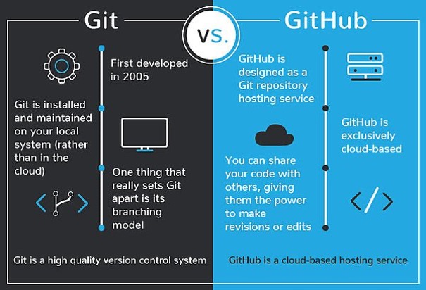

# 🚀 Git Tutorial  
### Learn Version Control with Git, VS Code & GitHub  

👨‍💻 
Trevor Douglas
SSE Lab Instructor

---

## 🧠 What Is Git?

- A **version control system**
- Tracks **changes in files**
- Helps you **collaborate** on code
- Commonly used with **GitHub**

---


---

## 🛠 Installing Git

- Download from [git-scm.com](https://git-scm.com)
- Verify install:

```bash
git --version
```

---

## ⚙️ Basic Setup

Configure your identity:

```bash
git config --global user.name "Your Name"
git config --global user.email "you@example.com"
```

---

## 📁 Create a New Repo

```bash
mkdir my-project
cd my-project
git init
```

- Creates a `.git` folder
- Now Git is tracking the project

---
## ➕ Add & Commit

```bash
git touch temp.txt. \\ Open in an editor and add some texts
git add .
git commit -m "Initial commit"
```

- `git add .`: Stage all changes
- `git commit`: Save a snapshot

```bash
# Or, in one step to stage and commit

git commit -am "Initial commit"
```
---



---

## 🔄 Using a Remote Repository

- What if we want to have a more public repsoitory on a server. 
- One example of this is GitHub.  
- There a couple of ways to do this.
- Add the remote location on GitHub to our local repository.
- Create a repository on GitHub and clone it.

---

## 🔄 Cloning a GitHub Repository

- First create the repository on GitHub.
- Then clone.

```bash
git clone https://github.com/yourname/repo.git
```

- Makes a full copy of a remote repository.

---

## 📤 Push to GitHub

```bash
# If you need to connect your local repo, then add the remote
git remote add origin https://github.com/yourname/repo.git
git push -u origin main
```

- Connects local repo to GitHub
- Pushes your commits

---

## 📥 Pull Changes

```bash
git pull origin main
```

- Sync your local repo with GitHub

---

## 🧪 Branches

```bash
git checkout -b feature-xyz
```

- Use branches to isolate changes

---

## ✅ Merge Changes

```bash
git checkout main
git merge feature-xyz
```

- Merges `feature-xyz` into `main`

---

## 🔍 Status & Log

```bash
git status
git log
```

- View current changes and history

---

## 🧼 Undo & Reset

```bash
git restore file.txt
git reset --soft HEAD~1
```

- Restore files or undo commits

---

## 📦 .gitignore

Ignore files from tracking:

```plaintext
node_modules/
*.log
.env
```

---

## 🧠 Git + VS Code

- Built-in Git sidebar
- Stage, commit, and push with GUI
- GitLens extension for deeper insight

---

## 🎉 Summary

✅ Track changes  
✅ Collaborate safely  
✅ Revert with confidence  
✅ Publish to GitHub


